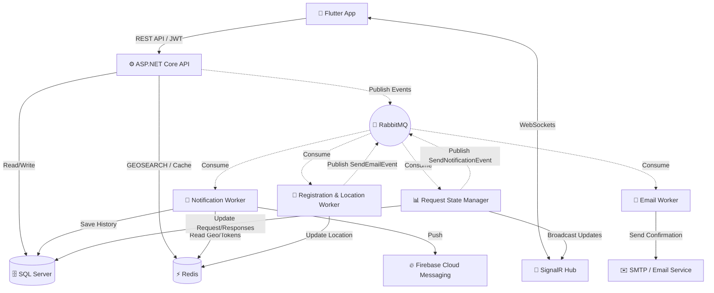

# 🩸 Elixir - Intelligent Blood Donation System API

[](https://dotnet.microsoft.com/)
[](https://docs.microsoft.com/en-us/ef/core/)
[](https://redis.io/)
[](https://www.rabbitmq.com/)
[](#)

> **Elixir** is an Intelligent Blood Donation System designed to bridge the gap between patients and donors in real-time. It efficiently connects patients who need blood with nearby compatible donors using location-based queries and real-time event-driven communication.

📱 **[Download Elixir on Google Play](https://play.google.com/store/apps/details?id=com.elixir.blood_donation)** 🌐 **[Explore the API Documentation (Swagger)](http://elixir.runasp.net/swagger/index.html)**

---

## 📖 About The Project

Finding compatible blood donors in critical times is a major challenge. **Elixir** solves this by automating the search, matching, and notification process. 

**How it works:**
1. A patient requests a specific blood type.
2. The system calculates compatible blood types.
3. It searches for nearby available donors using GeoSpatial queries.
4. Donors receive real-time notifications to respond to the request.
5. The patient can confirm attendance or report no-shows. If a no-show is reported, the system automatically triggers a search for alternative donors.

---

## 🏗 System Architecture & Workflow

Elixir designed with scalability, decoupling, and high performance in mind, utilizing an **Event-Driven Architecture** within a monolithic boundary.



---

## ✨ Key Features

* **Real-time Donor Matching:** Instantly identifies compatible donors within a specific geographic radius using Redis GeoSpatial.
* **Automated Emergency Workflow:** Automatically triggers a secondary search if a donor reports a "No-Show".
* **Live Updates:** Real-time tracking of donor responses via SignalR WebSockets.
* **Smart Notifications:** Intelligent push notifications via FCM tailored to compatible blood types and proximity.
* **Secure Authentication:** Multi-layered security with JWT, Refresh Tokens, and Google OAuth integration.
* **Health Data Management:** Securely handles sensitive donor information and donation history.

---

## 🚀 Key Technical Highlights

This backend is built focusing on **Performance, Scalability, and Real-Time Communication**:

* 🧠 **Redis & GeoSpatial Data:** Implemented Service-Level & Attribute-Based Caching to speed up lookups and compatible blood type retrieval.
  * Leveraged **Redis GeoSpatial** to perform lightning-fast queries for nearby users based on coordinates, ensuring donors are found instantly.


* 📨 **Event-Driven Architecture (RabbitMQ & MassTransit):** Decoupled background tasks using the **Publisher/Subscriber pattern**.
  * Asynchronously handles sending notifications, emails, updating live locations, and processing request state changes without blocking the main thread.


* ⚡️ **Real-Time Communication (SignalR):** Maintains a live, bidirectional connection to push real-time blood request updates, ensuring the live donor response count is always accurate and synchronized.
* 🔔 **Firebase Cloud Messaging (FCM):** Integrated push notifications to alert donors instantly on their mobile devices when they are matched with a critical request.

---

## 🛠 Tech Stack & Architecture

### **Core Technologies**

* **Backend Framework:** ASP.NET Core API
* **Database:** SQL Server
* **ORM:** Entity Framework Core (Code First Approach)

### **Architecture & Design Patterns**

* **Architecture:** Onion Architecture (Clean Architecture) ensuring a highly testable and loosely coupled codebase.
* **Patterns:** Generic Repository, Unit of Work, Specification Pattern.

### **Messaging & Real-Time**

* **Message Broker:** RabbitMQ (via MassTransit)
* **Real-Time:** SignalR WebSockets
* **Notifications:** Firebase Cloud Messaging (FCM)

### **Performance & Security**

* **Caching:** Redis (Distributed Caching)
* **Security:** JWT (JSON Web Tokens) Authentication, Secure Refresh Tokens, and API Key for endpoint protection.

---

## 📂 Clean Architecture Structure

The solution is structured into **7 decoupled projects** following **Clean Architecture** principles. This design enforces a strict separation of concerns, ensuring that all business rules remain fully isolated within the Core layer:

```text
BloodDonation.Solution/
│
├── 1. Core
│   ├── 📦 DomainLayer          (Entities, Models, Custom Exceptions, Repository Contracts)
│   ├── 📦 ServiceAbstraction   (Business Logic Interfaces)
│   └── 📦 Service              (Business Logic Implementations, MassTransit Consumers, Mapping Profiles, Specifications)
│
├── 2. Infrastructure
│   ├── 📦 Persistence          (EF Core DbContext, Repositories, Migrations, Data Seeding)
│   └── 📦 Presentation         (API Controllers, Custom API Attributes)
│
├── 3. ASP.NET API
│   └── 📦 Elixir.API   (Program.cs, SignalR Hubs, Exception Middleware, Redis Data Seeder Worker)
│
└── 4. Cross-Cutting Concerns
    └── 📦 Shared               (DTOs, RabbitMQ Integration Events, Error Models)

```

---

## ⚙️ Getting Started (Local Setup)

To run Elixir on your local machine, follow these detailed steps to set up the environment and configure the required services.

### 🛠 Prerequisites

Ensure you have the following installed and configured before running the project:

* **[.NET 8.0 SDK](https://dotnet.microsoft.com/download/dotnet/8.0)**
* **SQL Server** (LocalDB or a full local instance).
* **Redis Server** (Running locally on default port `6379`).
* **RabbitMQ** (Running locally on default port `5672`).
* **Firebase Account:** You need a Firebase project to download the Service Account Key (`elixir-firebase-adminsdk.json`) for Push Notifications.
* **Google Cloud Console:** To generate the `ClientId` for Google Authentication.
* **Email Account:** A valid email with an "App Password" generated to send OTPs and notifications via SMTP.

### 🚀 Installation Steps

**1. Clone the repository:**

```bash
git clone [https://github.com/Yehia-Dakhly/Elixir.git](https://github.com/Yehia-Dakhly/Elixir.git)
cd Elixir

```

**2. Setup Firebase Admin SDK:**
Place your downloaded Firebase service account key file (must be named `elixir-firebase-adminsdk.json`) directly into the root directory of the API project (`Elixir.API`).

**3. Configure Environment Variables:**
Navigate to the API project (`Elixir.API`) and open `appsettings.json` file. Ensuring you replace all the placeholder values (e.g., `YOUR_API_KEY_HERE`) with your actual credentials.

**4. Apply Database Migrations:**
Open your terminal in the root directory of the solution and run the following command to create the database and apply Entity Framework migrations:

```bash
dotnet ef database update --project Infrastructure/Persistence --startup-project Elixir --context BloodDonationDbContext

```

**5. Run the Application:**
Navigate to the API project folder and start the server:

```bash
cd Elixir
dotnet run

```

## 🔒 API Security

To interact with the protected endpoints via Swagger or Postman, you must provide the following credentials:

1. **X-Api-Key:** Must be included in the request header (Value defined in your `appsettings.json`).
2. **Authorization:** Standard Bearer Token for authenticated users (`Bearer <YOUR_JWT_TOKEN>`).
*Once the API starts, you can explore and test all endpoints through the **Swagger UI** at `http://localhost:<port>/swagger`.*

---

## 👥 The Team behind Elixir

This complete system was conceptualized and brought to life by a dedicated cross-functional team:

* **Founder, Tech Lead & System Architect:** [Yehia Mohamed Dakhly](https://www.google.com/search?q=https://www.linkedin.com/in/yehia-dakhly/) - *Conceived the product idea, engineered the complete system architecture, assembled the development team, and managed the entire project lifecycle from initial analysis to final API deployment.*
* **UI/UX Designer:** [Somaya Asaad](https://www.google.com/search?q=https://www.linkedin.com/in/somaya-asaad-10005b322/) - *Architected the end-to-end user journey and visual identity, crafting high-fidelity, empathy-driven interfaces focused on accessibility and a seamless donor-patient experience.*
* **Flutter Developer:** [Zaid Salah](https://www.google.com/search?q=https://www.linkedin.com/in/ziad-salah-338378262/) - *Engineered the high-performance cross-platform mobile experience, implementing complex state management and real-time backend synchronization to ensure a responsive connection between users.*

---